<p align="center">
  <a href="https://trendrider.net">
    
  </a>
</p>

<p align="center">
  <a href="https://github.com/darkvolg/Trading/blob/master/FreqtradeBot/user_data/strategies/TrendRiderStrategy_public.py"></a>
  <a href="https://github.com/freqtrade/freqtrade"></a>
  <a href="https://trendrider.net/live"></a>
  <a href="https://trendrider.net/live"></a>
  <a href="#license"></a>
  <a href="https://t.me/GennadyYakubovsky"></a>
</p>

# TrendRider — Open-Source Crypto Trading Strategy

A multi-indicator confluence strategy for [Freqtrade](https://github.com/freqtrade/freqtrade), running on Bybit USDT-perpetual futures. **Code is open. Numbers are public. Failures are documented.**

🔗 **Live dashboard** → [trendrider.net/live](https://trendrider.net/live) (updates every 5 minutes from the bot's database)

💼 **Need a custom trading bot, backtest, or exchange integration?** I build these for clients — Freqtrade setup, strategy backtesting, Telegram bots, exchange APIs. Contact: [@GennadyYakubovsky](https://t.me/GennadyYakubovsky)

---

## TL;DR

| | Value |
|---|---|
| **Live since** | April 1, 2026 (paper-trading on $500) |
| **Live stats** | Real-time on [trendrider.net/live](https://trendrider.net/live) — trades, P&L, win rate, drawdown |
| **Backtest stats** | Latest hyperopt+walk-forward results published on [/live](https://trendrider.net/live) per strategy version |
| **Pairs** | 13 USDT-perp (BTC, ETH, SOL, DOGE, XRP, ADA, AVAX, DOT, POL, NEAR, ATOM, SUI, OP) |
| **Timeframe** | 1h candles |
| **Risk** | Hyperopt-tuned stoploss + ROI ladder + trailing stop, 8 protections (cooldown, stoploss-guard, max-drawdown), max-open-trades cap |

> **No real money is at risk yet.** This is a public dry-run experiment — paper-trading first, real capital only after a long honest track record.

---

## Why This Repo Is Different

The crypto-bot space is full of black boxes promising 200% APY. This isn't that.

- ✅ **Open source** — every line of strategy code in [`TrendRiderStrategy_public.py`](FreqtradeBot/user_data/strategies/TrendRiderStrategy_public.py). No hidden logic, no API key required to read what it does.
- ✅ **Public live performance** — every trade, every loss, on [trendrider.net/live](https://trendrider.net/live). API serves directly from the bot's SQLite DB. No edits possible.
- ✅ **Honest post-mortems** — [13 days of breakeven trading documented publicly](https://trendrider.net/blog/freqtrade-bot-14-days-breakeven-v4-fix-2026), including the moment one fix turned `-$0.06` into `+$6.42`.
- ✅ **Walk-forward validated** — every hyperopt run holds out a final period as out-of-sample. If new params don't beat baseline on the held-out window, they don't ship. Process is committed to git — every parameter change is traceable.
- ✅ **Conservative claims** — paper-trading first, real money only after a long honest track record. No promises of life-changing returns.

---

## Strategy Logic (1-minute version)

For each candle, every pair is scored across 8+ technical indicators:

| Indicator | What it measures |
|---|---|
| EMA fast/slow crossover | Trend direction |
| RSI | Overbought / oversold |
| MACD histogram | Momentum shift |
| ADX | Trend strength |
| Bollinger Bands | Volatility envelope |
| ATR | Volatility magnitude |
| Volume ratio | Conviction |
| Market regime classifier | Bull / Bear / Ranging / High-Vol |

Each indicator scores 0-2 points (bear/neutral/bull). Total 0-10. **Trades fire only at high confidence in the current regime.** Exact thresholds are hyperopt-tuned and live in the strategy file.

Exits use a **hyperopt-tuned ROI ladder + custom_exit cascade**:
- `early_loss_cut_2h / 4h / 8h / 16h` — staged early-exit ladder if a trade isn't working
- `time_exit_24h` — hard cap on holding period
- `trend_broken` — exit if structural EMA setup reverses
- Hyperopt-tuned ROI ladder + trailing stop layered on top

Concrete numeric thresholds live in [`TrendRiderStrategy_public.py`](FreqtradeBot/user_data/strategies/TrendRiderStrategy_public.py) and update each time we re-run hyperopt with fresh data.

---

## Quick Start

Prerequisites: Python 3.10+, Docker (recommended), a Bybit account (testnet for dry-run).

```bash
# 1. Clone this repo
git clone https://github.com/darkvolg/Trading.git
cd Trading/FreqtradeBot

# 2. Install Freqtrade (follow https://www.freqtrade.io/en/stable/installation/)

# 3. Copy config and add your Bybit testnet API keys
cp config.json my-config.json
# Edit my-config.json — set "key" and "secret"

# 4. Download historical data (one-time)
freqtrade download-data --exchange bybit --timeframe 1h \
  --pairs BTC/USDT:USDT ETH/USDT:USDT SOL/USDT:USDT DOGE/USDT:USDT \
  --timerange 20260104-20260423

# 5. Run a backtest to verify the same numbers we publish
freqtrade backtesting --config my-config.json \
  --strategy TrendRiderStrategy --strategy-path user_data/strategies \
  --timerange 20260104-20260423

# 6. Go live in dry-run mode (paper trading)
freqtrade trade --config my-config.json --strategy TrendRiderStrategy
```

Full setup walkthrough: [Freqtrade Tutorial 2026: From Zero to Live Trading Bot](https://trendrider.net/blog/freqtrade-setup-tutorial-beginners-2026)

---

## How to Verify Our Claims

**Don't trust — verify.** Here's how to check every claim on this page yourself:

| Claim | How to verify |
|---|---|
| Backtest stats | Clone repo, run backtest command above. Reproduce locally on the same data the bot uses. |
| Live stats | Visit [/live](https://trendrider.net/live) — JSON API at [/api/live-stats.json](https://trendrider.net/api/live-stats.json) updated every 5 min directly from the bot's SQLite DB |
| Walk-forward validation | Read git history — every hyperopt commit includes the in-sample + out-of-sample numbers, so curve-fitting is visible if it happened |
| No external paid APIs | Search the strategy file — only TA-Lib indicators, no `requests` calls to paid services |
| Open-source | You're reading the source. |

---

## Repo Structure

```
Trading/
├── FreqtradeBot/                      # Bot configuration + strategy
│   ├── config.json                    # Pair whitelist, max trades, exchange
│   └── user_data/strategies/
│       └── TrendRiderStrategy_public.py   # The strategy itself
├── landing/                           # trendrider.net source code (Next.js)
│   ├── app/blog/                      # 50+ articles on bot design, SEO
│   ├── app/live/                      # Public live dashboard
│   └── components/                    # UI
└── README.md                          # This file
```

The strategy file is the only file you need to run the bot. The `landing/` folder is the marketing site source — included for transparency, not required for trading.

---

## Live Performance Methodology

The [/live](https://trendrider.net/live) dashboard is fed by [`scripts/export_live_stats.py`](https://github.com/darkvolg/Trading) (on the production server) which:

1. Reads `tradesv3.dryrun.sqlite` — the bot's SQLite trade log
2. Aggregates: total/closed/open trades, P&L, win rate, exit-reason breakdown
3. Writes JSON to `/var/www/trendrider/api/live-stats.json`
4. Cron runs this every 5 minutes

Numbers can't be massaged — the JSON is direct from the database the bot writes to.

---

## Hyperopt + Walk-Forward Methodology

Parameters (entry thresholds, ROI ladder, stoploss, trailing stop) are tuned via [Freqtrade hyperopt](https://www.freqtrade.io/en/stable/hyperopt/) — periodically re-run with fresh data.

Process:

1. **Train (in-sample)** — hyperopt searches parameter space on the bulk of historical data
2. **Hold-out (out-of-sample)** — a final ~14 days is reserved and **never seen during hyperopt**
3. **Validation gate** — new params must beat the previous baseline on the hold-out window. If they don't, they don't ship
4. **Commit** — every parameter change goes to git with the in-sample + out-of-sample numbers, so curve-fitting is visible after the fact

When a hyperopt run fails the validation gate (it has happened — we've rolled back), the live bot stays on the previous baseline rather than chasing pretty in-sample backtests. The most recent successful set of params is what's running on [/live](https://trendrider.net/live).

---

## Roadmap

- [ ] PR [#334](https://github.com/freqtrade/freqtrade-strategies/pull/334) merged into [`freqtrade/freqtrade-strategies`](https://github.com/freqtrade/freqtrade-strategies)
- [ ] First monthly performance report (end of April 2026)
- [ ] 30 days of live data → switch from $500 paper to $500 real-money
- [ ] Pro Pack: pre-tuned config + monthly hyperopt updates (paid tier)
- [ ] Multi-exchange support (Binance, OKX) — currently Bybit only

---

## Disclaimer

**This is not financial advice.** Past performance does not guarantee future results. Cryptocurrency trading involves substantial risk of loss. Backtests model historical conditions and may not reflect future market behavior. Live results so far are paper-trading only — no real money has been risked.

If you choose to run this strategy with real funds:
- Start with the smallest amount you can afford to lose entirely
- Keep dry-run mode active for at least 30 days first
- Monitor the bot's behavior in your specific market conditions
- Understand that any bot can have a losing streak

---

## Contributing

Issues and PRs welcome. Particularly interested in:
- Bug reports with reproducible scenarios
- Ideas for additional indicators or exit logic (please backtest first)
- Documentation improvements

---

## License

GPL-3.0 — same license as [Freqtrade](https://github.com/freqtrade/freqtrade) itself, the framework this strategy runs on. You're free to use, modify, and redistribute, as long as derivative works remain open-source under the same license.

See [LICENSE](LICENSE) for full text.

---

## Links

- 🌐 Website: [trendrider.net](https://trendrider.net)
- 📊 Live dashboard: [trendrider.net/live](https://trendrider.net/live)
- 📝 Blog: [trendrider.net/blog](https://trendrider.net/blog)
- 💬 Telegram: [@TrendRiderSignals](https://t.me/TrendRiderSignals)
- 🤖 Built on: [freqtrade/freqtrade](https://github.com/freqtrade/freqtrade)
